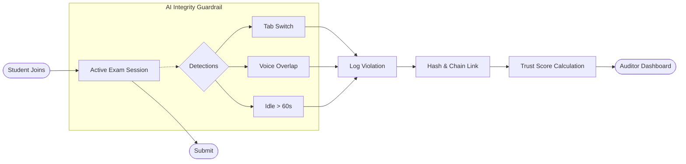

# 🛡️ Exam Guardrail: AI-Powered Integrity Monitoring

An advanced, real-time exam proctoring system that leverages AI-driven audio analysis and local blockchain technology to ensure academic integrity.

## 🚀 Key Features

### 🎙️ AI Voice Overlapping Detection
Unlike simple noise detection, our system uses **Spectral Complexity Analysis** to distinguish between a single speaker and multiple voices speaking simultaneously. It identifies "cheating conversations" by monitoring frequency peaks and volume heuristics in real-time.

### ⛓️ Local Blockchain Integrity Ledger
Every violation logged is cryptographically secured.
- **SHA-256 Chaining**: Each violation is hashed and linked to the previous one, creating an immutable audit trail.
- **Tamper-Evident**: Auditors can verify the entire session's integrity with one click. If any record is modified in the database, the blockchain "breaks," alerting officials.

### 🕵️ Real-time Proctoring Guardrails
- **Tab Switch Detection**: Automatically locks the exam for 60 seconds if a student leaves the window.
- **Window Resize Protection**: Flags attempts to use side-by-side windows.
- **Idle Monitoring**: Detects if a student has been inactive for more than 60 seconds.
- **Trust Score System**: Dynamic scoring that penalizes different violations based on severity (e.g., -10 for voice overlap).

---

## 🛠️ Technology Stack

- **Frontend**: React, TypeScript, Tailwind CSS, Lucide Icons, Framer Motion.
- **Backend**: Node.js, Express, Drizzle ORM.
- **AI/ML**: Web Audio API (Spectral Analysis), LM Studio (Question Generation).
- **Database**: PostgreSQL (via Drizzle).
- **Security**: Crypto (Local Blockchain), SHA-256 Hashing.

---

## 📋 System Flow



---

## ⚙️ Getting Started

### Prerequisites
- Node.js (v18+)
- PostgreSQL
- LM Studio (running locally on port 1234)

### Installation
1. Clone the repository
2. Install dependencies:
   ```bash
   npm install
   ```
3. Set up your environment variables in `.env`
4. Push the database schema:
   ```bash
   npx drizzle-kit push
   ```
5. Start the development servers:
   ```bash
   # Start API Server
   cd artifacts/api-server && npm run dev
   
   # Start Frontend
   cd artifacts/exam-guardrail && npm run dev
   ```

---

## 📝 Violation Penalty Rules

| Violation Type | Penalty | Description |
| :--- | :--- | :--- |
| **Tab Switch** | -10 pts | Student switched to another tab or application. |
| **Voice Overlap** | -10 pts | Multiple voices detected speaking simultaneously. |
| **Keyboard Attempt** | -15 pts | Attempted restricted shortcuts (Ctrl+C, etc.). |
| **Window Resize** | -5 pts | Window shrunk below 80% of screen size. |
| **Idle Detection** | -5 pts | No activity for more than 60 seconds. |

---

Developed with ❤️ for Academic Integrity.